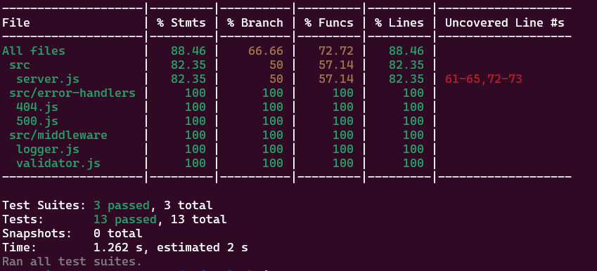
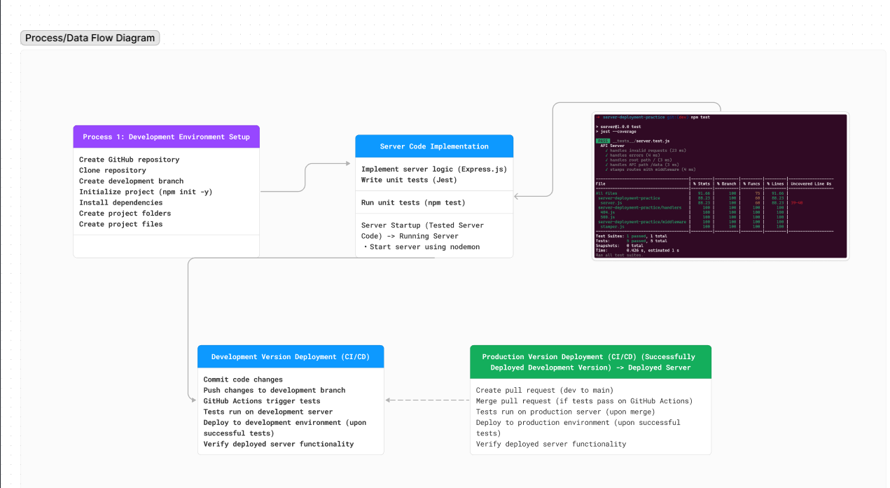

# basic-express-server

- [class 2: instructor note: README](https://github.com/codefellows/seattle-javascript-401d58/blob/main/class-02/README.md)
- [Render deployment](https://basic-express-server-35p7.onrender.com/)
- [Github action link](https://github.com/QILINXIE02/basic-express-server/actions)
- [PR to main](https://github.com/QILINXIE02/basic-express-server/pull/1)

# Basic-express-server
# Lab: Express Dynamic API (Phase 1)
## Project: Build a basic Express server with modularity, middleware, and tests.

## Testing Requirements
Assert the following:
- 404 on a bad route.
- 404 on a bad method.
- 500 if no name in the query string.
- 200 if the name is in the query string.
- Given a name in the query string, the output object is correct.

## tests:

## Installation and Testing

### How to Install the App or Library?

To install the application, clone the repository to your local machine:

1. Git clone [<https://github.com/QILINXIE02/basic-express-server.git>](https://github.com/QILINXIE02/basic-express-server.git)

2. Install your dependencies – npm install cors dotenv express jest supertest

3. Test your server – npm test

##Documentation
UML/Process/Data Flow Diagram:

